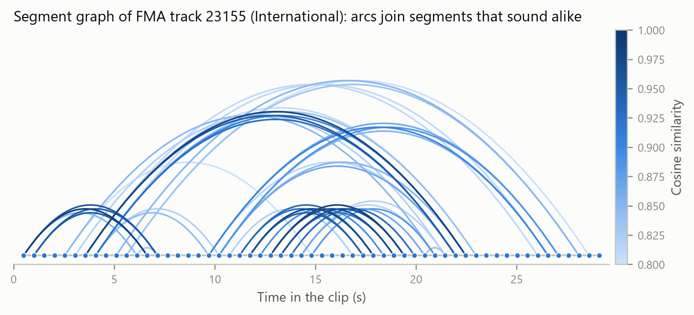
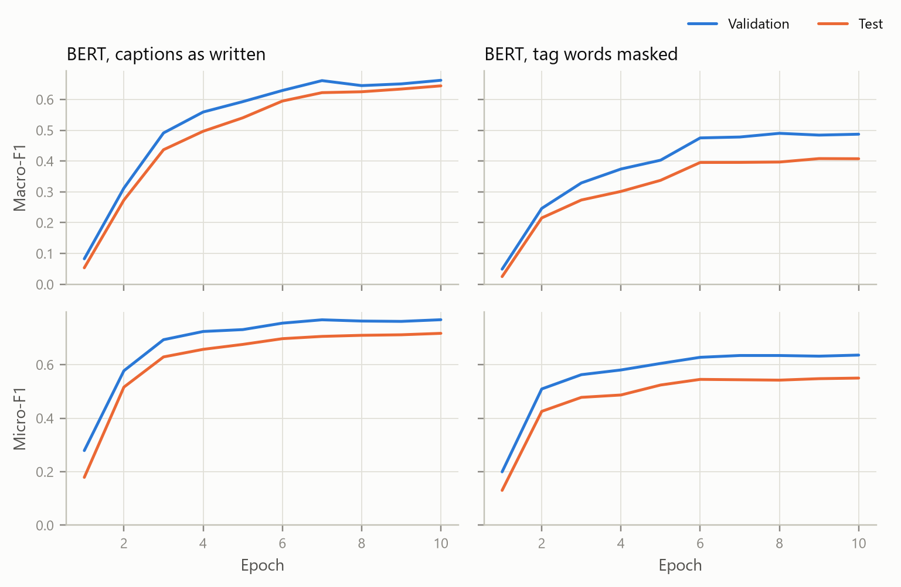
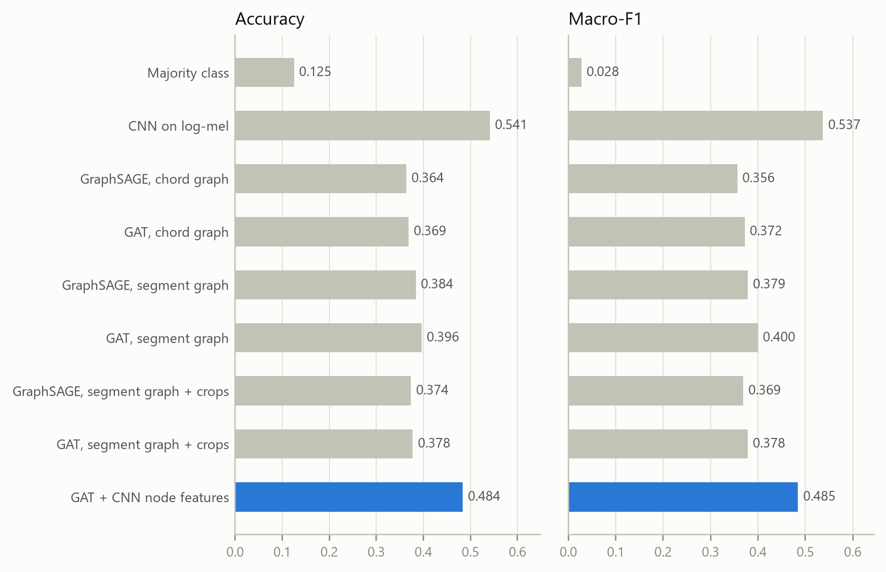
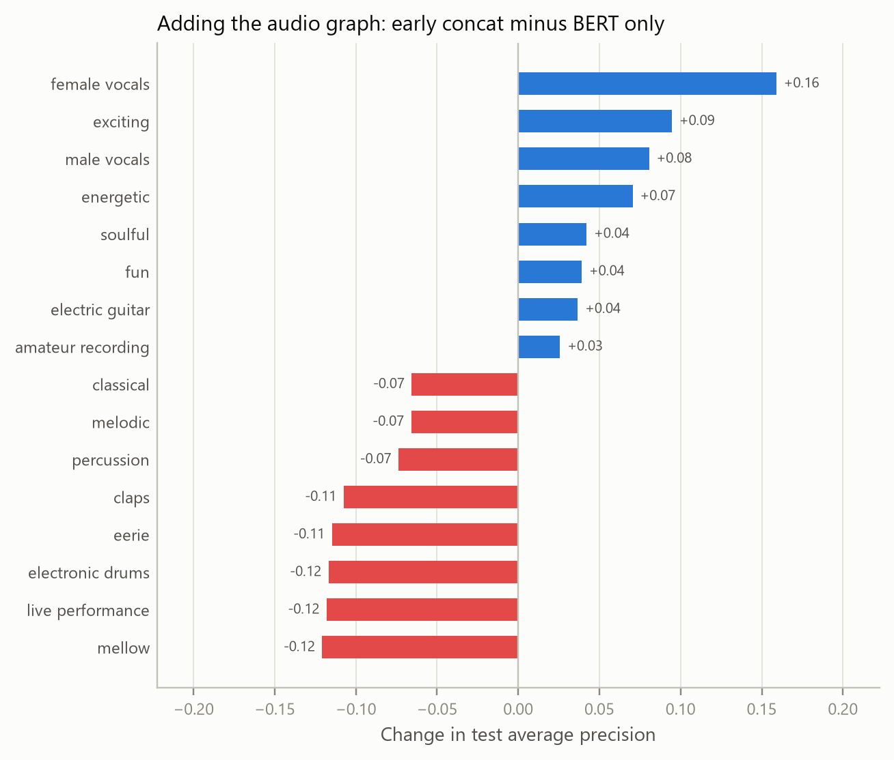

# Leitmotif

**Understanding musical context by reading a song two ways: as a graph of its own structure, and through the words people use to describe it.**

Songs repeat themselves. Choruses come back, riffs loop, and a bridge breaks the pattern. Leitmotif turns each clip into a graph: one-second segments are nodes, and edges link segments that follow each other or sound alike, so a returning chorus becomes a long arc in the graph. A graph neural network reads that structure, BERT reads the caption, and cross-attention lets each side look at the other.



The system can:

- **Tag** a clip with genre, mood, instrumentation and recording quality
- **Search** music by description, e.g. *"a sad piano ballad with strings"*
- **Point to where it happens**: show which one-second segments each word of a caption attends to

> Solo project by Mahdi Hasan for CSE425 (Neural Networks), BRAC University.

## How it works

```mermaid
flowchart LR
    audio["Audio clip"] --> seg["1 s segments<br/>log-mel, chroma, MFCC"]
    seg --> graph["Segment graph<br/>time + similarity edges"]
    graph --> gnn["GNN<br/>GAT + CNN node features"]
    text["Caption"] --> bert["BERT"]
    gnn -->|"graph embedding, node states"| fuse["Cross-attention fusion"]
    bert -->|"token states"| fuse
    fuse --> tags["50 context tags"]
    gnn -.-> search["Text-to-music search<br/>(contrastive)"]
    bert -.-> search
```

| Stage | Question | Model | Data | Status |
|---|---|---|---|---|
| 1 | Can text alone predict context tags? | BERT multi-label classifier | MusicCaps captions | Done |
| 2 | Does song structure predict genre? | GraphSAGE / GAT on segment and chord graphs, vs. a CNN | FMA-small audio | Done |
| 3 | Does structure add to text? | GNN + BERT cross-attention, with ablations | MusicCaps audio + captions | Done |
| 4 | Can we search music with words? | Contrastive dual encoder (InfoNCE) | MusicCaps audio + captions | Done |

## Results so far

### Stage 1: tags from captions

MusicCaps test split, 2,858 captions, 50 tags. Captions and tags were written together, and 65.6% of tag occurrences appear word-for-word in the caption, so the model is also trained with those words replaced by `[MASK]`.

| Model | Macro-F1 | Micro-F1 | AUC-PR |
|---|---|---|---|
| Random guess at tag frequency | 0.078 | 0.125 | 0.078 |
| BERT, captions as written | **0.659** | **0.720** | **0.680** |
| BERT, tag words masked | 0.458 | 0.569 | 0.471 |

Hiding the tag words costs 0.2 macro-F1, but the rest of the caption still carries a lot of context.



### Stage 2: genre from audio structure

FMA-small test split, 800 tracks, 8 balanced genres, artist-filtered.

| Model | Accuracy | Macro-F1 |
|---|---|---|
| Majority class | 0.125 | 0.028 |
| GraphSAGE / GAT, chord-transition graph | 0.364 / 0.369 | 0.356 / 0.372 |
| GraphSAGE / GAT, segment graph | 0.384 / 0.396 | 0.379 / 0.400 |
| GAT, segment graph + **CNN node features** | 0.484 | 0.485 |
| CNN on the full log-mel spectrogram | **0.541** | **0.537** |

With hand-crafted node features, graph models reach 0.40 macro-F1. Letting a small CNN read each segment's spectrogram patch lifts the same GAT to 0.485. The plain CNN is still best overall. The hybrid is better on Electronic (recall 0.72 vs. 0.58) and Rock (0.56 vs. 0.50), and worse on International and Pop.



### Stage 3: does the audio graph add anything to the text?

MusicCaps test clips that have audio (2,555), captions with tag words masked, 50 tags.

| Model | Macro-F1 | Micro-F1 | AUC-PR |
|---|---|---|---|
| Graph only (audio) | 0.227 | 0.304 | 0.170 |
| **BERT only (masked caption)** | **0.468** | **0.556** | **0.459** |
| Early concatenation | 0.448 | 0.535 | 0.438 |
| Cross-attention | 0.440 | 0.528 | 0.428 |

On these aggregate numbers the honest answer is no: text alone stays ahead, even though the audio graph on its own is three times better than random guessing. The per-tag picture is more useful. Audio helps exactly where a masked caption goes quiet, such as who is singing and which instruments play, and costs accuracy on tags the remaining words still describe.



### Stage 4: search music by description

Retrieval over the 2,555 test clips, where chance R@10 is 0.004.

| Direction | R@1 | R@5 | R@10 | Median rank |
|---|---|---|---|---|
| Caption → audio | 0.013 | 0.051 | 0.087 | 151 |
| Audio → caption | 0.013 | 0.056 | 0.095 | 140 |

That is roughly 20 times chance: the matching clip usually lands in the top 6% of 2,555 candidates. Rather than run a listening test, every retrieved clip is scored from 1 to 5 by three judges that share no weights with these models, next to random clips as a reference.

| Judge | Retrieved clips | Random clips |
|---|---|---|
| Tag overlap | 1.70 | 1.32 |
| Caption similarity (MiniLM) | 3.61 | 3.13 |
| Audio-text agreement (CLAP) | 4.49 | 3.45 |

## Try it

Once stages 3 and 4 are trained (see [Reproduce](#reproduce)):

```bash
uv sync --group demo
uv run --group demo python app/app.py        # web demo: search by description, analyze a clip
```

From Python:

```python
from src.inference import Leitmotif

lm = Leitmotif()
lm.search("aggressive distorted electric guitars with fast drums")   # closest MusicCaps clips
lm.tags("song.wav", "a mellow piano ballad")                         # predicted context tags
lm.explain("song.wav", "a mellow piano ballad")                      # words x segments attention
lm.describe("song.wav")                                              # nearest human captions
```

Notebooks: [`notebooks/eda.ipynb`](notebooks/eda.ipynb) explores the data and the graphs; [`notebooks/demo_context.ipynb`](notebooks/demo_context.ipynb) runs one clip end to end.

## Reproduce

Needs [uv](https://docs.astral.sh/uv/), Python 3.12, ffmpeg, and Node or Deno (yt-dlp uses it for YouTube). PyTorch comes from the CUDA 12.8 index, which also covers RTX 50-series GPUs. Everything, including model downloads and package caches, stays inside the repository folder.

```bash
uv sync
bash scripts/reproduce.sh
```

[`scripts/reproduce.sh`](scripts/reproduce.sh) runs every step in order: downloads, splits, feature extraction, all training runs, evaluation and figures. Downloads resume if interrupted. On one RTX 5060 Laptop GPU (8 GB), the whole pipeline takes roughly half a day, most of it downloading MusicCaps clips and training the BERT-based models. Every setting is in [`config.yaml`](config.yaml); results are written to `results/metrics.json`.

Individual steps:

```bash
uv run python scripts/download_data.py musiccaps-csv fma-small
uv run python scripts/download_musiccaps_audio.py
uv run python -m src.datasets                              # splits and the 50-tag vocabulary
uv run python -m src.preprocess fma_small                  # features, graphs, spectrograms
uv run python -m src.train gnn_genre --arch gat --graph segment --cnn-nodes
uv run python -m src.plots                                 # figures, also copied to report/figures
```

## Data

| Dataset | Used for | What it provides | License |
|---|---|---|---|
| [MusicCaps](https://huggingface.co/datasets/google/MusicCaps) | Stages 1, 3, 4 | 5,521 ten-second clips with musician-written captions and aspect tags; audio is fetched from YouTube, and 4,910 clips (88.9%) could still be retrieved | CC BY-SA 4.0 |
| [FMA](https://github.com/mdeff/fma) (small) | Stage 2 | 8,000 thirty-second tracks across 8 genres with artist-filtered splits (6 files in the release cannot be decoded) | Metadata CC BY 4.0; audio under each artist's Creative Commons license |

Raw downloads go to `data/raw/` and are not committed. Twenty example graphs are saved in `data/processed/samples/` as `.pt` and `.json`.

## Report

[`report/`](report/) is a self-contained NeurIPS-style LaTeX project: upload the folder to Overleaf and compile `main.tex`. Its figures are regenerated into `report/figures/` by `python -m src.plots`.

## Repository layout

```
leitmotif/
├── config.yaml                 # every preprocessing, graph and training setting
├── pyproject.toml, uv.lock     # dependencies; requirements.txt is a pip export
├── app/app.py                  # Gradio demo
├── data/
│   ├── raw/                    # downloads (not committed)
│   ├── processed/              # features and graphs; samples/ is committed
│   └── splits/                 # train / val / test ids and the tag vocabulary
├── notebooks/                  # eda.ipynb, demo_context.ipynb
├── report/                     # LaTeX report with its figures
├── results/                    # metrics.json, training histories, plots, retrieval examples
├── scripts/
│   ├── download_data.py        # MusicCaps captions, FMA-small
│   ├── download_musiccaps_audio.py
│   └── reproduce.sh            # the whole pipeline in order
└── src/
    ├── audio_features.py       # log-mel, chroma, MFCC, segments and patches
    ├── graph_builder.py        # segment and chord graphs
    ├── tags.py, datasets.py    # synonym merging, loaders, splits, caption masking
    ├── preprocess.py           # features and graphs for every clip, in parallel
    ├── bert_encoder.py         # stage 1
    ├── gnn_model.py            # stage 2: GraphSAGE / GAT, CNN node features
    ├── baselines.py            # random, majority and CNN baselines
    ├── fusion_model.py         # stage 3: cross-attention fusion and ablations
    ├── contrastive.py          # stage 4: InfoNCE dual encoder
    ├── train.py, evaluate.py   # training loops and metrics
    ├── relevance.py            # automatic relevance judges for retrieved clips
    ├── inference.py            # use trained models on any audio file
    ├── plots.py                # figures
    └── export_samples.py       # sample graphs as .pt and .json
```

## References

- Defferrard et al. *FMA: A Dataset for Music Analysis.* ISMIR 2017.
- Agostinelli et al. *MusicLM: Generating Music From Text.* arXiv:2301.11325, 2023. (Introduces MusicCaps.)
- Devlin et al. *BERT: Pre-training of Deep Bidirectional Transformers for Language Understanding.* NAACL 2019.
- Hamilton, Ying and Leskovec. *Inductive Representation Learning on Large Graphs.* NeurIPS 2017. (GraphSAGE)
- Veličković et al. *Graph Attention Networks.* ICLR 2018; Brody, Alon and Yahav. *How Attentive are Graph Attention Networks?* ICLR 2022. (GATv2)
- van den Oord, Li and Vinyals. *Representation Learning with Contrastive Predictive Coding.* arXiv:1807.03748, 2018. (InfoNCE)
- Elizalde et al. *CLAP: Learning Audio Concepts from Natural Language Supervision.* ICASSP 2023. (Used as an independent relevance judge.)

## License

Code is MIT licensed. Datasets keep their own licenses.
